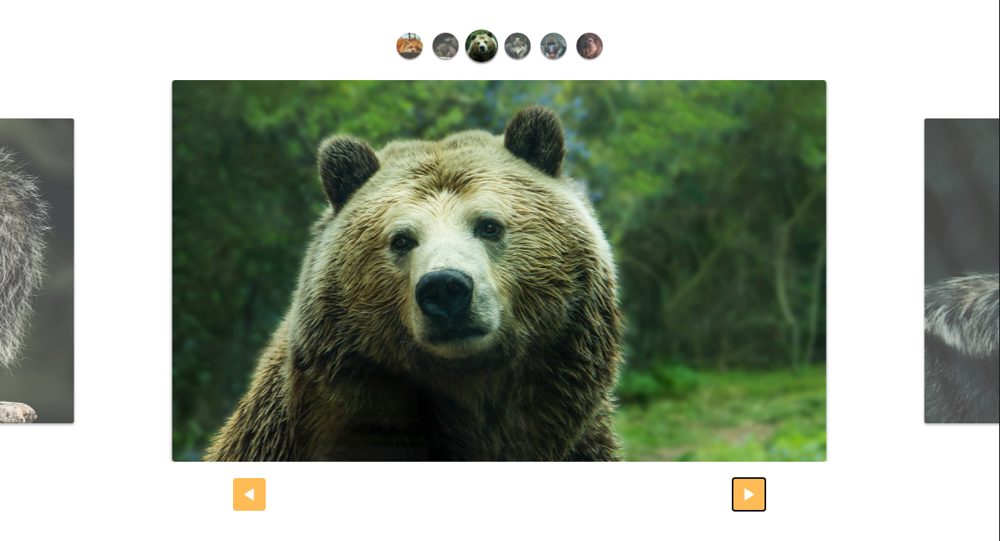
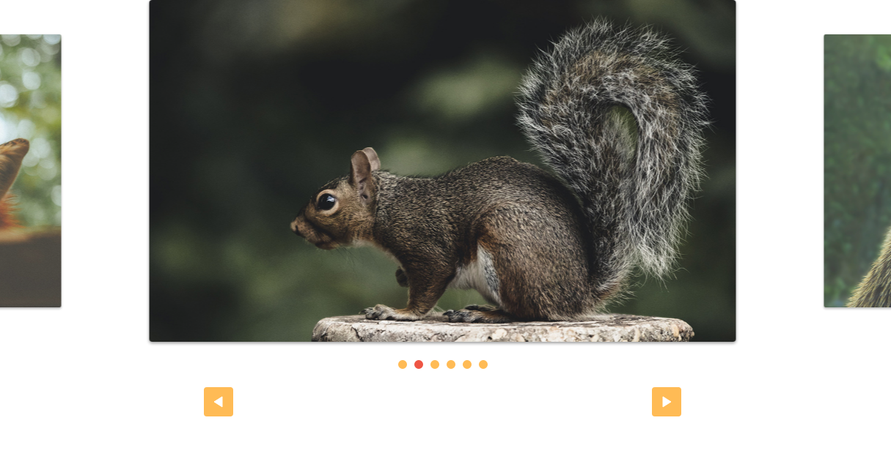

    
    <h1 align="center">Slide</h1>
     

## :rocket: Tecnologias

Esse projeto tem como base as seguintes tecnologias:

- [Javascript](https://developer.mozilla.org/pt-BR/docs/Web/JavaScript)
- [HTML 5](https://developer.mozilla.org/pt-BR/docs/Web/HTML)
- [CSS 3](https://developer.mozilla.org/pt-BR/docs/Web/CSS)

##  :pushpin: Projeto

O Slide foi implementado em Javascript vanilla com arquitetura de classes, possui custom controls totalmente adaptáveis, otimizado e responsivo. Você pode navegar entre os slides por toque, clique nos botões, clique nas paginações (thumbnails ou bolinhas). 

    
Preview custom controls 1

    
     
     
     
     
    
Preview custom controls 2

    
     

## :thinking: Como contribuir

- Faça um fork desse repositório;
- Cria uma branch com a sua feature: `git checkout -b minha-feature`;
- Faça commit das suas alterações: `git commit -m 'feat: Minha nova feature'`;
- Faça push para a sua branch: `git push origin minha-feature`.

Depois que o merge da sua pull request for feito, você pode deletar a sua branch.

---

Feito com ❤️ by **Stefany Sá**
